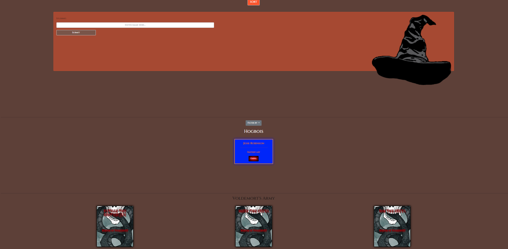

# Sorting Hat

A single page web application that lets you create first year students in the Potterverse and send them to the magic hat to be assigned a house! You can also expel students to send them to the dark army!

## Screenshots
Early build

Finished Styling

## Wireframe/Mockup

## Project Board

https://github.com/jrobinson0529/sorting-hat/projects/1
## Features

A bootstrap jumbotron with a button that opens a form.
  - In this form you can enter a name and hit 'submit'.
  - When you submit a student is created in the Hogwarts section with a card displaying the name that was input and a randomly selected house.

You can delete student cards which places them into a new section called 'Voldemort's Army'.

Sound effects play on certain button clicks

Animations!

## How to Access

Navigate to [link](https://jr-sortinghat.netlify.app/)

## Loom Walkthrough

https://www.loom.com/share/8472b57c53e245b5a94575cb5334b950

## Contributors

[Jesse Robinson](https://github.com/jrobinson0529)
